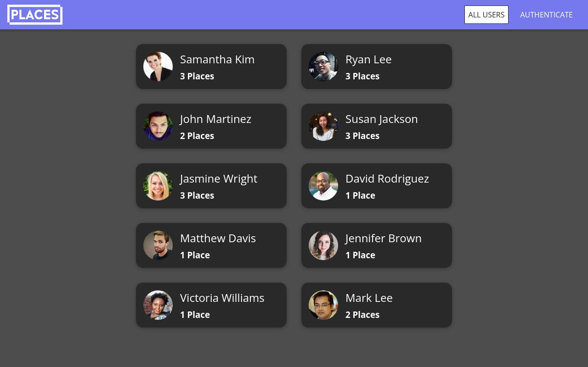

# PlacesApp

PlacesApp is a React+Vite frontend for sharing places built following the code from [Build fullstack React.js applications with Node.js, Express.js &amp; MongoDB (MERN) with this project-focused course](https://udemy.com/course/react-nodejs-express-mongodb-the-mern-fullstack-guide) by [Maximilian Schwarzmüller](https://academind.com/).

This frontend uses the [PlacesApp-API](https://github.com/rolodoom/placesapp-api)

## Status

## Preview

**[View Live Preview](https://placesapp-rolodoom.netlify.app/)**

## Usage

Clone the source files and navigate into the app's root directory. Run `npm install` and then run `npm run dev` which will open up a preview of the app in your default browser, watch for changes to source files, and live reload the browser when changes are saved. You can view the `package.json` file to see which scripts are included.

## Available Scripts

You must have npm installed in order to use this build environment.

### `npm run dev`

Runs the app in the development mode.\
Open http://localhost:3000 to view it in your browser.

The page will reload when you make changes.\
You may also see any lint errors in the console.

### `npm run build`

Builds the app for production to the `dist`. You may deploy this `dist` folder to any of your preferred platforms.

Your app is ready to be deployed!

### `npm run preview`

Once you've built the app, you may test it locally by running `npm run preview` command.

The `vite preview` command will boot up a local static web server that serves the files from `dist` at http://localhost:4173. It's an easy way to check if the production build looks OK in your local environment.

### More about Deploying a Static Site

See the section about [deployment](https://vitejs.dev/guide/static-deploy) on Vite.js for more information.

## Bugs and Issues

Have a bug or an issue with this template? [Open a new issue](https://github.com/rolodoom/placesapp-frontend/issues) here on GitHub.

## License

This code is released under the [GPL-3.0](https://github.com/rolodoom/placesapp-frontend/blob/main/LICENSE) license, which means you have the four freedoms to run, study, share, and modify the software. Any derivative work must be distributed under the same or equivalent license terms.
